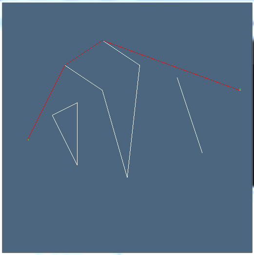

## Algorithms and Artificial Intelligence Projects

###### Disclaimer: Projects are for study purposes only and still could be greatly improved(optimized).

### Path Finding
* Implements A* search algorithm for finding shortest path between 2 points on the field with polygon obstacles.

### Sudoku Solver
* Not an ideal sudoku solver, but solves hardest sudoku from magazines and newspapers. Implements Backtracking with specific analyzer functions(they prune possible variants accelerating search process). 

###### Remark: When I say it doesn't solve some sudokus I mean it takes a lot of time to solve them - say up to 1 hour or even more(I don't check such cases).

### TicTacToe Game
* AI part implements heuristic A* search. 
* Supports playing with real opponent(duels) via sockets.